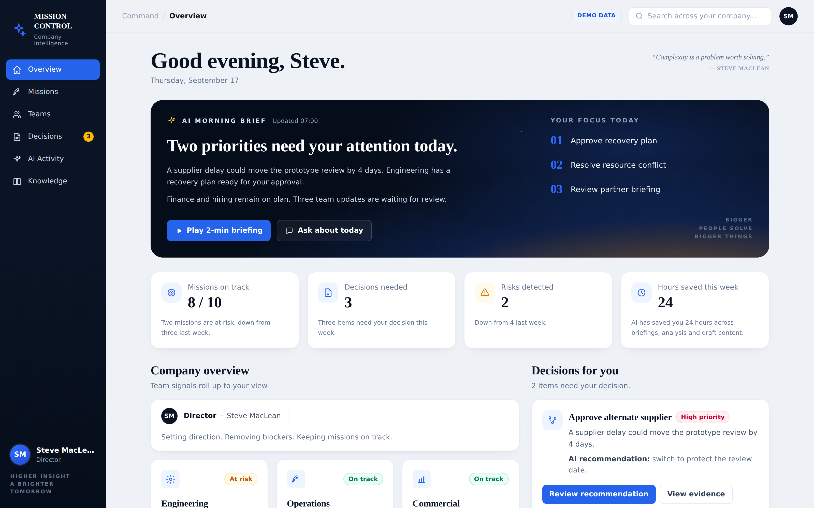

# Mission Control

An AI **company-intelligence dashboard** — a clickable, front-end-only demo.
Everything runs in the browser with local demo data; there is **no backend or API**.



## What's inside

The company runs on **six base projects** — three shipped **products** (Aperture
Sensor Array, Relay Ground Station, Nova Flight Software) and three **explorations
in testing** (Prototype v2, Autonomy Stack, Edge Data Platform). These are the
spine: the Overview surfaces the portfolio, a **Projects** view groups them, and
every mission, team and decision ties back to a project (missions roll up to their
project; teams show the projects they own; a project's page lists its missions).

A flight-director's-eye view that rolls team signals up into one command surface.
The demo is framed as a mission control for Steve MacLean — a former astronaut
now running the company from the flight director's console — so it uses authentic
mission-control language (T‑minus gates, Go / No‑Go readiness, nominal /
off‑nominal) throughout.

- **Control Room** — the mission-control "big board": one screen showing
  everything across every project — a **portfolio timeline** (each project's
  gates and mission milestones on a Now → year-end axis), an **all-projects
  status matrix**, the Go/No-Go **flight readiness** board, a **"Needs your
  call"** panel (open decisions + anomalies) and a **live activity** feed.
- **Overview** — a **T‑minus mission clock** to the next gate, an AI morning
  brief, today's focus, clickable headline stats (missions, decisions, risks,
  hours saved), a **Flight Readiness (Go / No‑Go) board**, a company overview
  with per-team cards + AI insights, the decisions that need you, and an
  "Ask Mission Control" bar.
- **Missions** — every mission with status, owner, due date and progress;
  filter by _All / On track / At risk_. Each card opens a **mission detail**
  page (`/missions/:id`) with milestones, an at-risk callout, the owning team
  and key facts.
- **Teams** — Engineering, Operations and Commercial, each with specialty and
  disciplines, **resourcing** (utilization + allocation breakdown + open
  roles), **past projects** with outcomes, a full **crew roster** (every person
  with role, current focus and status), metrics and an AI insight. Overview
  team cards deep-link here.
- **Decisions** — interactive decision cards: pick an option (the AI-recommended
  one is pre-selected) and confirm.
- **AI Activity** — a timeline of what the assistant did on your behalf.
- **Knowledge** — a searchable library of company docs.

### Interactive, no API

- **⌘K command palette** — press ⌘K / Ctrl+K to search and jump to any mission,
  team, decision or doc, or run quick actions, from anywhere. (This is where
  global search lives.)
- **AI Copilot** (Overview) — a ranked queue of recommended actions Steve can
  Accept / View / Dismiss, plus checkable **AI next steps** on each mission.
- **Ask about today** opens a demo chat interface; **Ask Mission Control** answers
  from canned, keyword-matched responses.
- The **focus priorities** in the hero are clickable and route to the relevant page.
- **Mission cards** open a full mission detail view; **decisions** are selectable
  and confirmable; actions surface toast feedback.
- All the demo content lives in [`src/data.ts`](src/data.ts) — edit it there.

## Design

A pure-black, typography-led system in the SpaceX / Tesla idiom: white type
carries the hierarchy, hairlines replace boxed cards, a single white accent, and
monochrome status (one muted amber for risk). Archivo for display, Inter for UI,
JetBrains Mono for every readout.

## Tech

React 19 · TypeScript · Vite · Tailwind CSS v4 · React Router.

## Getting started

```bash
npm install
npm run dev      # start the dev server (http://localhost:5173)
npm run build    # type-check + production build
npm run preview  # preview the production build
```

## Project structure

```
src/
  data.ts             # single source of demo data
  App.tsx             # routes
  components/         # Layout, Sidebar, TopBar, AskBar, Toast, icons, ui
  pages/             # Overview, Missions, Teams, Decisions, AIActivity, Knowledge
```
